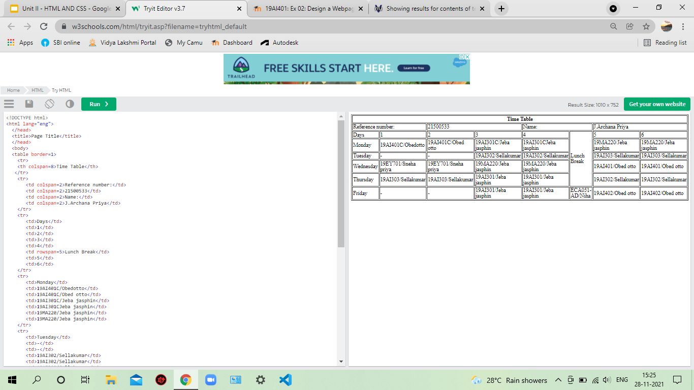

# Experiment_Time_Table

# AIM
To Write a html webpage page to display your timetable.

# ALGORITHM
## STEP 1
create a simple table using table tag
## STEP 2
Add header row using th tag
## STEP 3
Add your timetable
## STEP 4
Execute the program

# CODE
```<!DOCTYPE html>
<html lang="eng">
  </head>
  <title>Page Title</title>
  </head>
  <body>
  <table border=1>
    <tr>
    <th colspan=8>Time Table</th>
   </tr>
    <tr>
       <td colspan=2>Reference number:</td>
       <td colspan=2>21500533</td>
       <td colspan=2>Name:</td>
       <td colspan=2>J.Archana Priya</td>
    </tr>
    <tr>
       <td>Days</td>
       <td>1</td>
       <td>2</td>
       <td>3</td>
       <td>4</td>
       <td rowspan=5>Lunch Break</td>
       <td>5</td>
       <td>6</td>
    </tr>
    <tr>
       <td>Monday</td>
       <td>19AI401C/Obedotto</td>
       <td>19AI401C/Obed otto</td>
       <td>19AI301C/Jeba jasphin</td>
       <td>19AI301CJeba jasphin</td>
       <td>19MA220/Jeba jasphin</td>
       <td>19MA220/Jeba jasphin</td>
    </tr>
    <tr>
       <td>Tuesday</td>
       <td>-</td>
       <td>-</td>
       <td>19AI302/Sellakumar</td>
       <td>19AI302/Sellakumar</td>
       <td>19AI303/Sellakumar</td>
       <td>19AI303/Sellakumar</td>
    </tr>
    <tr>
       <td>Wednesday</td>
       <td>19EY701/Sneha priya</td>
       <td>19EY701/Sneha priya</td>
       <td>19MA220/Jeba jasphin</td>
       <td>19MA220/Jeba jasphin</td>
       <td>19AI401/Obed otto</td>
       <td>19AI401/Obed otto</td>
     </tr>
     <tr>
        <td>Thursday</td>
        <td>19AI303/Sellakumar</td>
        <td>19AI303/Sellakumar</td>
        <td>19AI301/Jeba jasphin</td>
        <td>19AI301/Jeba jasphin</td>
        <td>19AI302/Sellakumar</td>
        <td>19AI302/Sellakumar</td>
     </tr>
     <tr>
        <td>Friday</td>
        <td>-</td>
        <td>-</td>
        <td>19AI301/Jeba jasphin</td>
        <td>19AI301/Jeba jasphin</td>
        <td>ECA051-AD/Niha</td>
        <td>19AI402/Obed otto</td>
        <td>19AI402/Obed otto</td>
   </tr>
  </table>
  </body>
  </html>
  ```


# Output



# Result:
The respective output has been generated.
